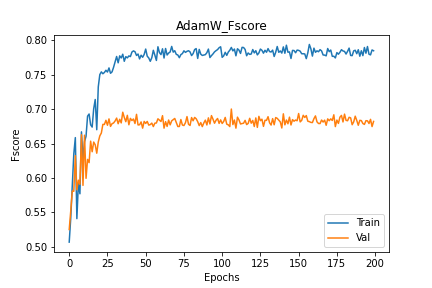
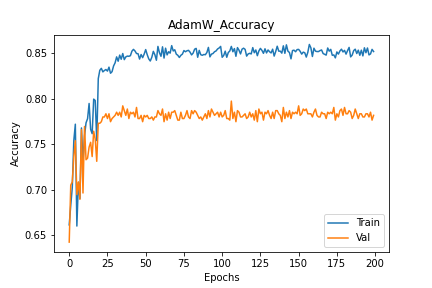
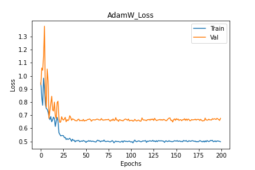
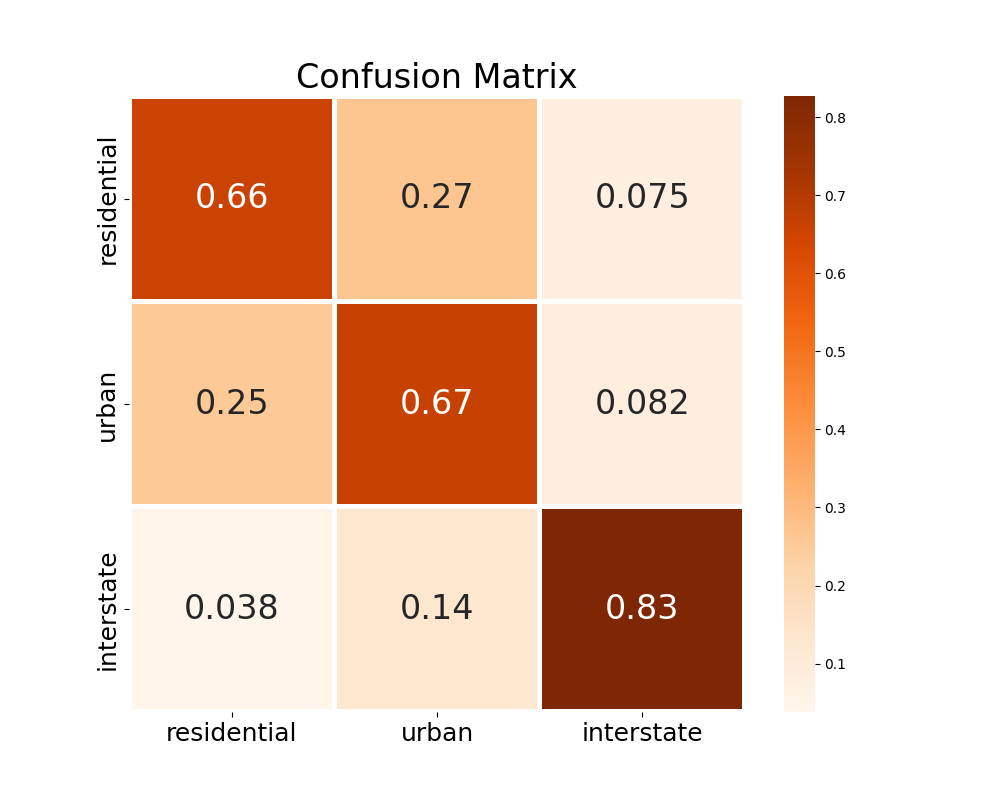
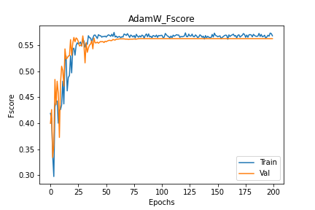
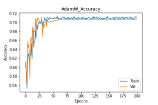
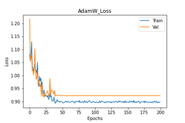
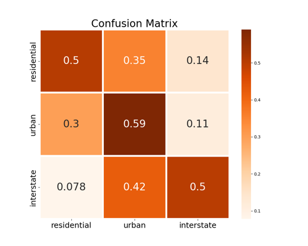

# Driving Environment Detection (Locality Calssification)
## Introduction
Driving Environment/Locality has significant impact on driving styles, speed, driver attention and various other factors that help study and improve driver safety in both traditional and autonomous driving systems. This project aims to percive and identify driving environment from image/video feeds based on the visual cues contained in them.

## Code use: Setting up Docker Environment and Dependencies
<ul>
    <li>Step 1: Clone the repository to local machine 
        <pre>git clone https://github.com/VTTI/Driving-Environment-Detection.git </pre>
    </li>
    <li>Step 2: cd to downloaded repository 
        <pre>cd [repo-name]</pre>
    </li>
    <li>Step 3: Build the docker image using Dockerfile.ML
    <pre>docker build -f Dockerfile.ML -t driving_env .</pre>
    </li>
    <li>Step 4: Run container from image and mount data volumes
        <pre>docker run -it --rm -p 9999:8888 -v $(pwd):/opt/app -v [path to data]:/opt/app/data --shm-size=20G driving_env</pre>
    example: <pre>docker run -it --rm -p 9999:8888 --user=12764:10001 -v $(pwd):/opt/app -v /vtti:/vtti --gpus all --shm-size=20G driving_env</pre>
    </li>You may get an error <pre>failed: port is already allocated</pre>
    If so, expose a different port number on the server, e.g. '9898:8888'
    <li>If you wish to run the jupyter notebook, type 'jupyter' on the container's terminal</li>
    <li>On your local machine perform port forwarding using
        <pre>ssh -N -f -L 9999:localhost:9999 host@server.xyz </pre>
    </li>
</ul>

## Dataset Information

Organize the data as follows in the repository. We use a custom dataset  70/20/10 train/val/test split respectively the dataset compiled from SHRP2 and Signal Phase video data. Our data set contains:
* 17174 training images.
* 2120 validation images.
* and 2147 test images.
 
<pre>
./
 |__ data
        |__ Interstate
        |__ Urban
	|__ Residential
        
</pre>

## Models

1. Baseline built on resnext50 backbone : To run and train the model use the configs/config_baseline.yaml file as input to --config flag and run.

2. Baseline_2 built on Vision Transformer backbone : To run and train the model use the configs/config_ViT.yaml file as input to --config flag and run.
 
3. To test a model with pretrained weights. Use --mode='test'/'test_single' and appropriate config file as input to --config flag and run.
### To run the code
<pre>
cd /opt/app
python main.py \
--config [optional:path to config file] \
--mode ['train', 'test', 'test_single'] \
--comment [optional:any comment while training] \
--weight [optional:custom path to weight] \
--device [optional:set device number if you have multiple GPUs]
</pre>

## Training & Testing

We trained the network on train and validation sets and tested its performance on a test set that the network never sees during training. The performance of the network is evaluated based on a combination of its loss, F-score and accuracy curves for training and validation, and its performance on the same metrics with the test data. Further, we also analyze the saliency maps of the calssified images to gather insights on the basis of classification.
Note that all models are initialized with pretrained weights from training on ImageNet calssification task.

### Training and Validation

#### Resnext50

The best model obtianed from training with various configurations of optimizers and hyperparameters including learning rate and epochs is with the use of AdamW optimizer. We trained the network for 200 epochs and ploted the performance curves which are as shown here.
<table style="padding: 10px">
    <tr>
        <td> </td>
        <td> </td>
        <td> </td>
    </tr>
</table>

### Test 
The results obtained by this base line on the entire test set :
* Loss: 0.6871
* Fscore: 71.15% 
* Confusion Matrices by class:
    * residential [tp,tn,fp,fn] : [369, 1313, 271, 193]
    * Urban [tp,tn,fp,fn] : [650, 935, 233, 328] 
    * Interstate [tp,tn,fp,fn] : [501, 1418, 122, 105]
* Accuracy : 80.55%

The confusion matrix on test set is as follows:
<table style="padding: 10px">
    <tr>
        <td> </td>
    </tr>
</table>

#### Vision Transformer

Alternate model was trained using Vision Transformer abd best wegiths for this were from training with various configurations of optimizers and hyperparameters including learning rate and epochs is with the use of AdamW optimizer. We trained the network for 200 epochs and ploted the performance curves which are as shown here.
<table style="padding: 10px">
    <tr>
        <td> </td>
        <td> </td>
        <td> </td>
    </tr>
</table>

### Test 
The results obtained by this vit model on the entire test set :
* Loss: 0.925
* Fscore: 56.5% 
* Confusion Matrices by class:
    * residential [tp,tn,fp,fn] : [339, 1217, 329, 234]
    * Urban [tp,tn,fp,fn] : [516, 800, 335, 468] 
    * Interstate [tp,tn,fp,fn] : [332, 1289, 268, 230]
* Accuracy : 71.45%

The confusion matrix on test set is as follows:
<table style="padding: 10px">
    <tr>
        <td> </td>
    </tr>
</table>

### Saliency
Some examples of saliency maps observed for each class.
* Interstate 
<table style="padding: 10px">
    <tr>
        <td> </td>
    </tr>
</table>

* Urban
<table style="padding: 10px">
    <tr>
        <td> </td>
    </tr>
</table>

* Residential
<table style="padding: 10px">
    <tr>
        <td> </td>
    </tr>
</table>

